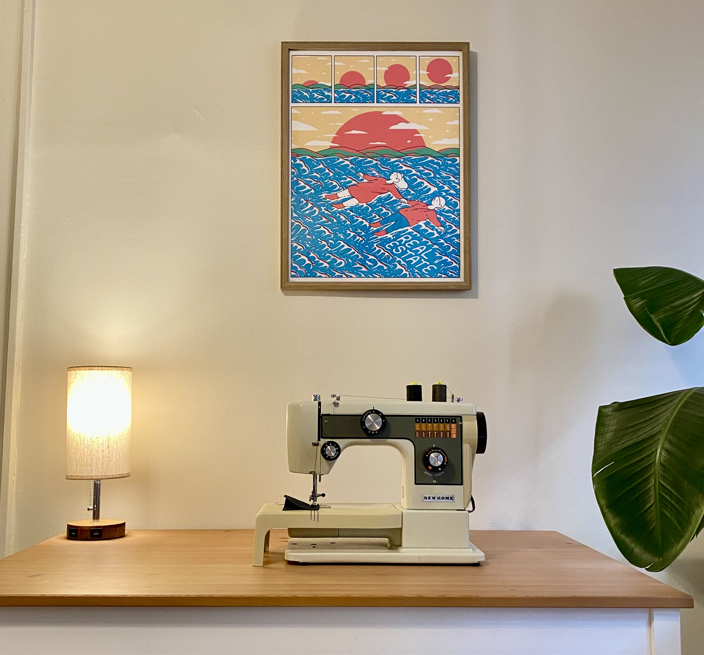

+++
template = 'home.html'

[extra]
lang = "en"

# Show footer in home page
footer = false

# If you don't want to display id/bio/avatar, simply comment out that line
name = ""
id = ""
bio = ""
avatar = ""
links = []

# Show a few recent posts in home page
recent = false
recent_max = 15
recent_more_text = "more »"
date_format = "%b %-d, %Y"
+++

Welcome!

