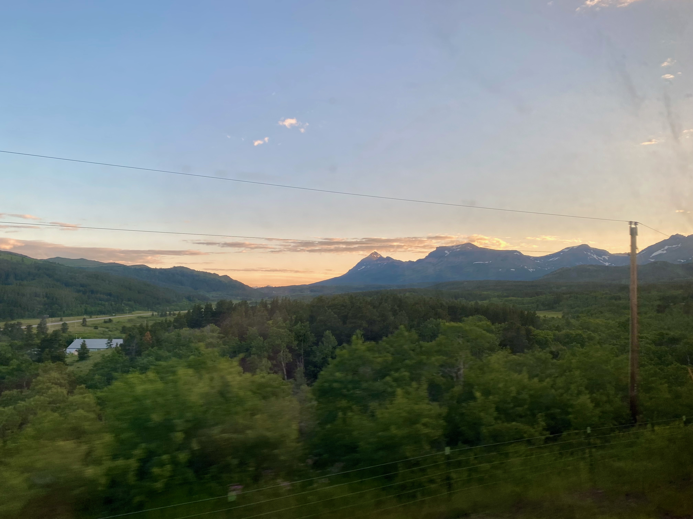
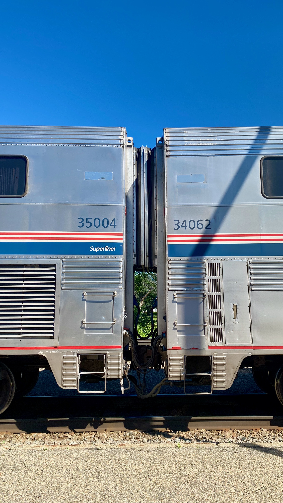
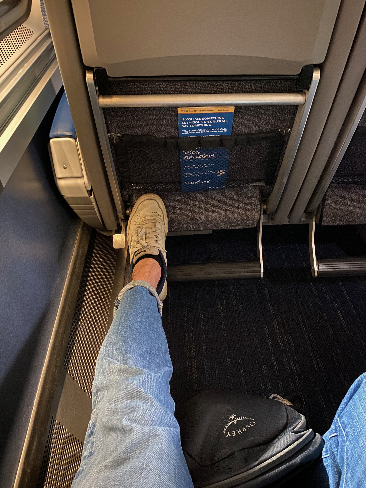
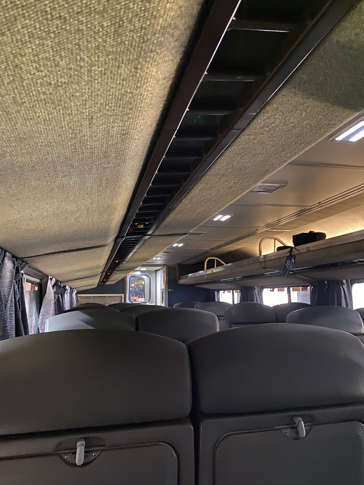

Last month, I spent 48 hours on Amtrak’s Empire Builder train from Chicago to Seattle. When I tell people that, their responses fall into basically two camps without a lot of in-between: enthusiasm and curiosity, and disgust.

So why put myself through that experience? At its core, I chose to travel by train (at least for the trip out) because of the uniqueness of long-distance train travel, especially for trips through the western half of the United States. It’s obviously slower than flying, but it allows you to explore the landscape of the country in a really rewarding way. During my cross-country cycling tour, I realized that the best way to see the world is on the ground; flights can provide some great views of mountain ranges and sunsets, but most of the time you’re either above the clouds or too high to make out any details of the scene below you (if you have a window seat at all) – and you’re still in a tiny box next to someone who doesn’t believe in headphones or personal space. On the train, however, you can see the fields of wheat blowing in the wind, the deer passing through creeks, the steepness of the terrain through a mountain pass. You can get up and stretch your legs, hang out in the all-windows observation car, or grab some food from the cafe. And no stressing about checked baggage limits or TSA officers yelling at you. [Slow travel](https://peterkalmus.net/books/read-by-chapter-being-the-change/being-the-change-chapter-10-slow-travel/) is simply more enjoyable travel.

As I continue to explore a more environmentally friendly lifestyle too, the harms done by airplanes are hard to overstate. Trains aren’t the world’s most eco-friendly travel option – walking, biking, or carpooling with a WVO-burning engine are probably mounds better – but just my return trip (and my share of it! not the whole thing!) created almost 1.4 tonnes of emissions. I could take _six_ Empire Builder trips for that cost.

The route started in Chicago and passed through Illinois, Wisconsin, North Dakota, Montana, Idaho, and Washington. I’m certainly biased, but my favorite states were Illinois (plains), Montana (mountains), and Washington (rolling hills).

<figure>

</figure>

<figure>

</figure>

So anyways, what’s it like on board the train?

The train has several carts, with half (the front) continuing to Seattle after Spokane and the other (the back) heading to Portland. It’s a double-decker train; the top level is the “main” level, while the bottom has restroom facilities and some smaller cabins (these fetch a premium since there’s no through-traffic to disturb you). While most carts are the standard makeup of coach seating on the top level with restrooms and private coach seats on the lower level, one cart holds the dining cart (table service) while another holds the observation room and cafe below it.

<figure>

</figure>

The bathrooms are airplane-style; a few have an extra changing area built in. They were commonly out of toilet paper and/or soap and/or paper towels, so bring wash cloth (or towel) and some hand sanitizer or just pop into the next free one to wash up. That said, I never had any issue with lines at the restrooms, but my train seemed only about 60-70% full.

There are water stations in almost every cart, so bring a water bottle or you’ll get very thirsty. But almost all of them were dry on my train and they weren’t refilled at any stations, so I simply learned to always go to the cafe cart for water. Note that the cafe does sell bottled water.

If you’re traveling alone and overnight, try to have an empty seat next to you for more comfortable sleeping. You can take the seat next to you, kick up the leg rests, and have a halfway decent sleeping setup. If you’re traveling with others, you might want to sit next to them so that, unless the train is super empty, there’s no chance of having a complete stranger next to you on an overnight leg (if it’s given that you have to sleep next to somebody, it’s at least preferable for it to be your partner/friend).

The noise is a valid concern. Earplugs are a good companion. People will be making noise, talking, and coughing. The train has ambient noise from the air system and the drivetrain itself. There are bursts of noise around stops, but during the night it’s manageable. The noise I found most irritating was the dining cart, calling out reservations every 30 minutes and for breakfast, lunch, and dinner! Quite a bit excessive.

There’s plenty of leg room in front, even with the chair in front of you fully reclined. The chairs are wider than those on an airplane, but nothing extravagant. There are pull-out tray tables about the same size as on an airplane too.

<figure>

</figure>

<figure>

</figure>

The food is mid but available. I can’t speak much to the dining cart – I only had one meal there, breakfast on the last day. My breakfast quesadilla was a pitiful excuse for one; they barely filled out the quesadilla and there were only like 2 strips of bell pepper and onions each ($20, plus tip). The cafe was much more available – open from around 7am to 11pm with ~hour-long breaks for the attendant to break and eat. It had a variety of hot and cold food, though most of the hot food was simply microwaveable meals. I had the vegan barbecue burger and it was fine (highly processed). The salads and sides were surprisingly good, as was the coffee! Still, it was easy to spend $15-20 on each meal. I brought several snack bars (Clif and fiber one), but if I were to do it over I’d bring still more food.

There’s a bit of sticker shock when you compare coach tickets to the private rooms, but I think splitting one with a friend or partner could actually be economical. Estimating $1,000 for the room but $500 each, that’s a difference of about $170 from coach. But it’s easy to spend $100 on food if you’re on board for 3 days and 2 nights; you’d also probably get a bit higher-quality food in the dining cart compared to the cafe. If you don’t have the right ticket, I think purchasing a meal at the dining cart costs $20 for breakfast/lunch and $45 for dinner. Plus, you get a foldout bed. So on the condition that you split it with somebody, I think it’s actually not such a bad deal.

All in all, I think it’s a great experience and everyone should travel by train at least once. Some day soon, air travel won’t be as cheap as it is and more folks will be traveling on wheels. And it’s not so bad to move a little slower; the time will pass regardless.
