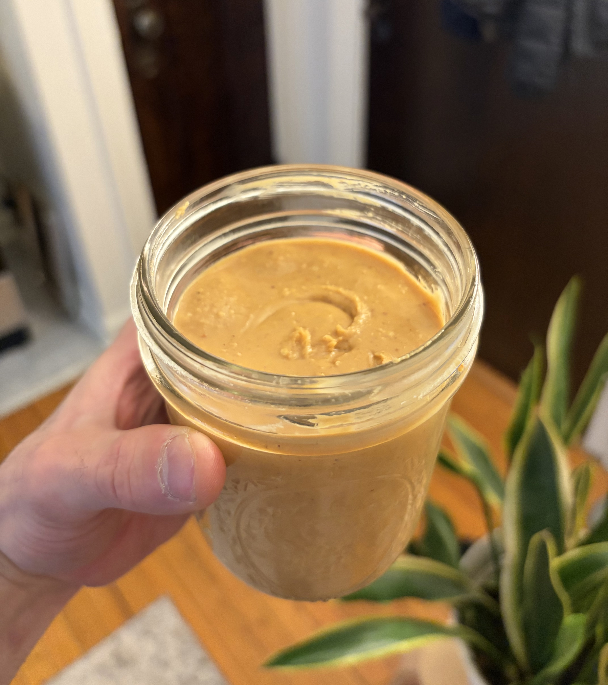

+++
title = "Blender Peanut Butter"
+++

## Ingredients

1 lb (453g) unsalted dry roasted peanuts (yields 12 oz)

## Preparation

Using the tamper to press the nuts into the blades and gradually increasing from the lowest speed, blend for 1 minute. You should hear a high-pitched chugging sound.

Once the butter begins to flow freely, reduce speed to 7/10. Blend for 30 more seconds.
