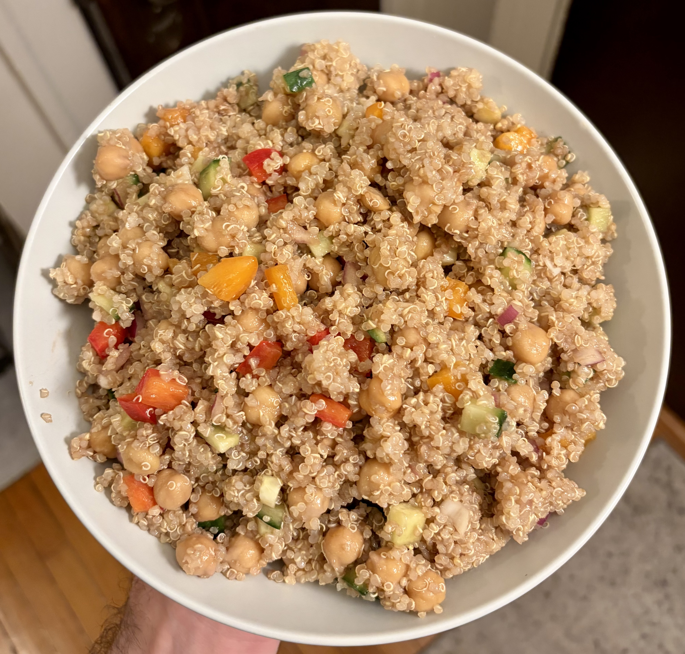

+++
title = "Chickpea Quinoa Salad"
+++

Makes 5x 32 oz servings

## Ingredients

- 1 lb dry chickpeas, cooked
- 1 lb (2.5 cups) dry quinoa, cooked
- 1 cucumber, diced
- 2 bell peppers, diced
- 1 red onion, diced
- 1/2 cup raisins

Dressing:

- Drizzle with olive oil, balsamic vinegar
- Garlic powder, salt, pepper to taste
